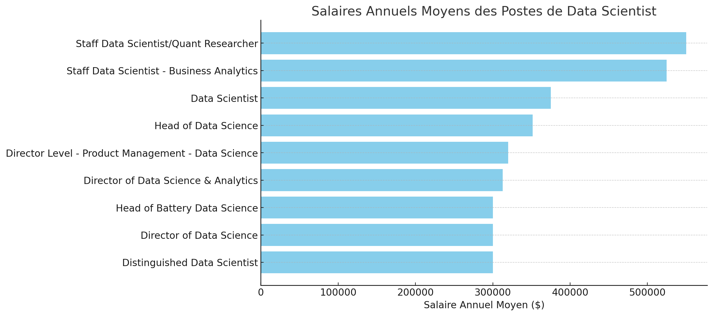

# Data Scientist Job Market Analysis 2023

📊 Dive into the Data Scientist Job Market! This analysis uncovers the 💰 highest-paying Data Scientist roles, 🔥 top in-demand skills, 📈 where high demand meets high salaries, 🌍 countries with the most opportunities, 🏢 companies hiring the most, 🌐 remote work salary comparisons, and 🎓 the impact of degree requirements on earnings in the field.

# Context

This project was born from the desire to navigate the Data Scientist job market more effectively, identifying the highest-paying jobs and most sought-after skills to optimize job searching.

### Main Questions Addressed by SQL Queries:

1. What are the highest-paying Data Scientist jobs?
2. What skills are required for these well-paid jobs?
3. What are the most in-demand skills?
4. Which countries offer the most opportunities?
5. Which companies are hiring the most?
6. Is remote work better paid?
7. Does degree requirement impact salary?

# Tools Used

For this in-depth analysis of the Data Scientist job market, I used:


# The Analysis

### 1. Top Highest-Paying Jobs

To identify the highest-paying Data Scientist roles, I filtered for remote positions and sorted by average yearly salary. This query highlights the most lucrative opportunities in the data science field.

```sql
SELECT
    job_id,
    job_title,
    job_location,
    job_schedule_type,
    salary_year_avg,
    job_posted_date,
    name AS company_name
FROM
    job_postings_fact
LEFT JOIN company_dim ON job_postings_fact.company_id = company_dim.company_id
WHERE
    job_title_short = 'Data Scientist' AND
    job_location = 'Anywhere' AND
    salary_year_avg IS NOT NULL
ORDER BY
    salary_year_avg DESC
LIMIT 10;
```

Here's the breakdown of the top Data Scientist jobs in 2023:

- **Wide Salary Range:** Top 10 paying Data Scientist roles range from $300,000 to $550,000, showcasing the excellent compensation potential in this field.
- **Diverse Employers:** Companies like Selby Jennings, Algo Capital Group, and Demandbase are leading the market with competitive salaries, demonstrating strong demand across various sectors.
- **Job Title Variety:** The positions range from Staff Data Scientist to Head of Data Science, reflecting the diverse career paths and specialization opportunities within data science.


_Bar graph visualizing the top 10 paying jobs for data scientist; ChatGPT generated this graph from my SQL query results_

### 2. Skills for Top-Paying Data Scientist Jobs

To understand what skills are required for the top-paying jobs, I joined the job postings with the skills data, providing insights into what employers value for high-compensation roles.

```sql
WITH top_paying_jobs AS (
    SELECT
        job_id,
        job_title,
        salary_year_avg,
        name AS company_name
    FROM
        job_postings_fact
    LEFT JOIN company_dim ON job_postings_fact.company_id = company_dim.company_id
    WHERE
        job_title_short = 'Data Scientist' AND
        job_location = 'Anywhere' AND
        salary_year_avg IS NOT NULL
    ORDER BY
        salary_year_avg DESC
    LIMIT 10
)

SELECT
    top_paying_jobs.*,
    skills
FROM top_paying_jobs
INNER JOIN skills_job_dim ON top_paying_jobs.job_id = skills_job_dim.job_id
INNER JOIN skills_dim ON skills_job_dim.skill_id = skills_dim.skill_id
ORDER BY
    salary_year_avg DESC;
```


_Bar graph visualizing the count of skills for the top 10 paying jobs for data scientist; ChatGPT generated this graph from my SQL query results_

### 3. In-Demand Skills for Data Scientists

Here's the breakdown of the most demanded skills for the top 5 highest paying data scientist jobs in 2023:

- **SQL**
- **Python** follows closely
- **R** is also highly sought after
  Other skills like **AWS**, **Tableau**, **scikit-learn**, and **tensorflow** show varying degrees of demand.

```sql
SELECT
    skills,
    COUNT(skills_job_dim.job_id) AS demand_count
FROM job_postings_fact
INNER JOIN skills_job_dim ON job_postings_fact.job_id = skills_job_dim.job_id
INNER JOIN skills_dim ON skills_job_dim.skill_id = skills_dim.skill_id
WHERE
    job_title_short = 'Data Scientist'
    AND job_work_from_home = True
GROUP BY
    skills
ORDER BY
    demand_count DESC
LIMIT 5;
```
| Compétence | Nombre d'occurrences |
|------------|-----------------------|
| Python     | 10,390               |
| SQL        | 7,488                |
| R          | 4,674                |
| AWS        | 2,593                |
| Tableau    | 2,458                |


### 4. Geographic Distribution (Top 5 countries)

To understand where the demand for data scientists is concentrated, I queried the job postings to identify the countries offering the most positions for data scientists.

```sql
SELECT job_country,
    COUNT(job_location) AS location_count
FROM job_postings_fact
WHERE job_title_short = 'Data Scientist'
    AND salary_year_avg IS NOT NULL
GROUP BY job_country
ORDER BY  location_count DESC
```

| Pays            | Nombre d'offres d'emploi |
|-----------------|--------------------------|
| États-Unis      | 4,502                    |
| Soudan          | 561                      |
| Inde            | 92                       |
| Royaume-Uni     | 76                       |
| France          | 57                       |


### 5. Top Company Offering Data Scientist Jobs in 2023

To gain insights into the companies that are actively hiring for Data Scientist positions, I queried the job postings to identify the organizations with the highest number of available roles.

```sql
SELECT
    name AS company_name,
    COUNT(job_id) AS job_count,
    job_via,
    ROUND(AVG(salary_year_avg), 2) AS average_salary
FROM
    job_postings_fact
LEFT JOIN company_dim ON job_postings_fact.company_id = company_dim.company_id
WHERE
    job_title_short = 'Data Scientist' AND
    job_location = 'Anywhere' AND
    salary_year_avg IS NOT NULL
GROUP BY
    company_name, job_via
ORDER BY
    job_count DESC
LIMIT 10;
```

| Company Name                            | Job Count | Job Channel            | Average Salary ($) |
| --------------------------------------- | --------- | ---------------------- | ------------------ |
| Harnham                                 | 34        | via LinkedIn           | 170,441.18         |
| Get It Recruit - Information Technology | 24        | via Get.It             | 127,854.17         |
| Patterned Learning AI                   | 15        | via ZipRecruiter       | 66,666.67          |
| Insight Global                          | 12        | via LinkedIn           | 128,208.33         |
| Motion Recruitment                      | 11        | via Motion Recruitment | 146,363.64         |
| CyberCoders                             | 10        | via Indeed             | 146,250.00         |
| Intelletec                              | 10        | via LinkedIn           | 170,750.00         |
| Get It Recruit - Transportation         | 8         | via Get.It             | 119,500.00         |
| CVS Health                              | 8         | via LinkedIn           | 143,437.50         |
| Averity                                 | 7         | via LinkedIn           | 208,928.57         |

The data reveals that Harnham leads the market with the highest number of Data Scientist job openings, followed by Get It Recruit in the Information Technology sector. A diverse range of job channels is being utilized, including LinkedIn, Get.It, and ZipRecruiter, indicating various pathways for job seekers.

### 6. Are Remote Data Scientist Job Offers Better Paid?

To compare the average salaries of remote and on-site Data Scientist positions, we analyzed job postings while focusing only on those with specified salaries (excluding null values).

```sql
SELECT
    CASE
        WHEN job_work_from_home = true THEN 'Remote'
        ELSE 'On-Site'
    END AS job_location,
    AVG(salary_year_avg) AS average_salary
FROM
    job_postings_fact
LEFT JOIN company_dim ON job_postings_fact.company_id = company_dim.company_id
WHERE
    job_title_short = 'Data Scientist' AND
    salary_year_avg IS NOT NULL
GROUP BY
    job_work_from_home
ORDER BY
    average_salary DESC;
```

| Job Location | Average Salary ($) |
| ------------ | ------------------ |
| Remote       | 144,398.25         |
| On-Site      | 134,306.56         |


The analysis shows that remote Data Scientist positions offer a higher average salary ($144,398.25) compared to on-site positions ($134,306.56). This information highlights the potential financial benefits of remote work opportunities in the field of data science.

### 7. Do Data Scientist Positions Without a Degree Requirement Impact Salary?

To compare the average salaries of Data Scientist positions with and without degree requirements, we analyzed job postings while focusing only on those with specified salaries (excluding null values).

```sql
SELECT
    CASE
        WHEN job_no_degree_mention = true THEN 'No Degree Required'
        ELSE 'Degree Required'
    END AS degree_status,
    AVG(salary_year_avg) AS average_salary
FROM
    job_postings_fact
LEFT JOIN company_dim ON job_postings_fact.company_id = company_dim.company_id
WHERE
    job_title_short = 'Data Scientist' AND
    salary_year_avg IS NOT NULL
GROUP BY
    job_no_degree_mention
ORDER BY
    average_salary DESC;
```

| Degree Status      | Average Salary ($) |
| ------------------ | ------------------ |
| Degree Required    | 136,142.27         |
| No Degree Required | 126,516.01         |

The analysis indicates that Data Scientist positions requiring a degree offer a higher average salary ($136,142.27) compared to those that do not require a degree ($126,516.01). This suggests that educational requirements may influence compensation for Data Scientist roles

# What I Learned

Throughout this journey, I have significantly enhanced my SQL capabilities with some powerful new skills:

- **🧩 Complex Query Crafting:** I’ve mastered advanced SQL techniques, seamlessly merging tables and utilizing WITH clauses for efficient temporary table management.
- **📊 Data Aggregation:** I’ve become proficient with GROUP BY, turning aggregate functions like COUNT() and AVG() into my go-to tools for data summarization.
- **💡 Analytical Wizardry:** I’ve sharpened my problem-solving skills, transforming analytical questions into actionable and insightful SQL queries.

# Conclusions

### Insights
From the analysis, several key insights emerged regarding the Data Scientist job market:

1. **Top-Paying Data Scientist Jobs:** The highest-paying Data Scientist roles offering remote work present a diverse salary range, with the top salary reaching $550,000!
2. **Skills for Top-Paying Jobs:** High-paying Data Scientist positions require advanced Python and SQL skills, underscoring their importance in achieving top salaries.
3. **Most In-Demand Skills:** Python stands out as the most sought-after skill in the Data Scientist job market, making it essential for aspiring professionals.
3. **Geographical Opportunities:** The United States dominates the job market for Data Scientists, but countries like Sudan and India also show significant opportunities, suggesting that professionals can consider various locations for employment.
3. **Impact of Remote Work:** Remote Data Scientist positions tend to offer higher average salaries than on-site roles, indicating a trend that could shape future employment choices in the industry.
3. **Educational Requirements:** While Data Scientist roles generally benefit from a degree, those without degree requirements still provide competitive salaries, highlighting opportunities for self-taught professionals.

### Closing Thoughts

This project has enhanced my SQL skills and provided insights into the Data Scientist job market, highlighting key areas for skill development and job search strategies. Aspiring Data Scientists can boost their competitiveness by focusing on high-demand skills.

Additionally, understanding geographic demand, remote work trends, and educational impacts enriches our perspective on the field. Continuous learning and adaptability are essential for success in this evolving landscape.

In summary, there are ample opportunities in Data Science for those who invest in their education and skills, especially in programming, data manipulation, and statistical analysis. With the right tools and knowledge, individuals can thrive in this exciting domain.


